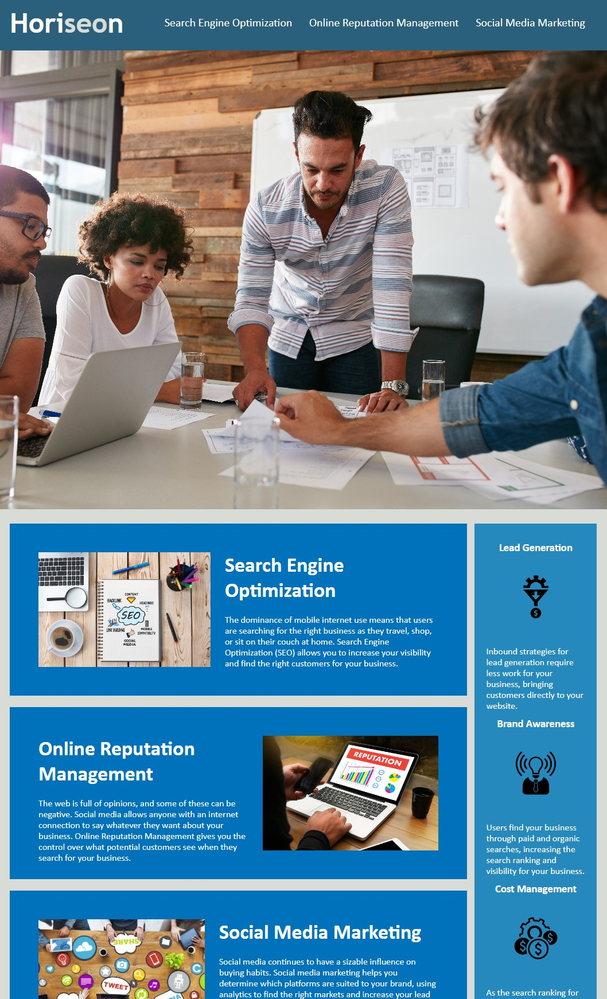

## 01 Code Refactor: Horiseon Webpage

## Description

* This project corrects broken links and fixes all bugs for a fully functioning site.

* It includes detailed comments in CSS explaining the function of the code.

* It condenses the CSS code into a more maintainable and understandable way using semantic structure 

## User Story

```
AS A marketing agency
I WANT a codebase that follows accessibility standards
SO THAT our own site is optimized for search engines
```

# Links

* Click the link to view the live webpage 

https://laurencvengros.github.io/horiseon_webpage/

## Images

* View a screenshot of the updated webpage



## Author

* My Name is Lauren
* Check out my other projects on GitHub: https://github.com/Laurencvengros?tab=repositories

* For any questions/comments email me at: L.Cvengros@icloud.com